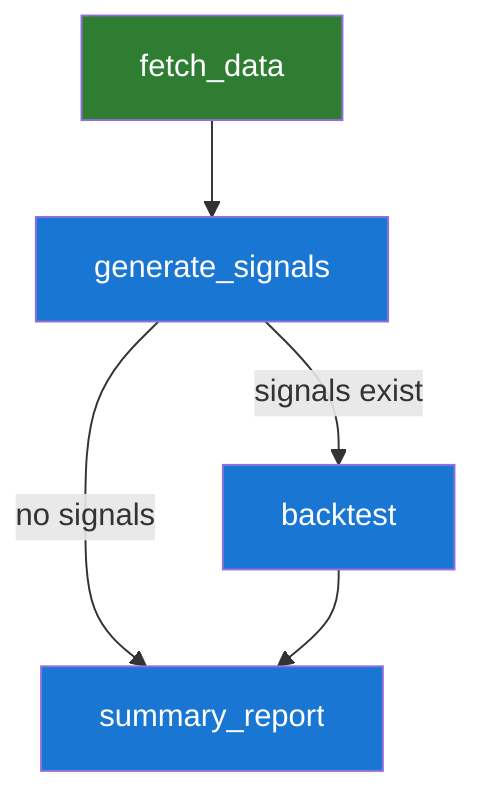
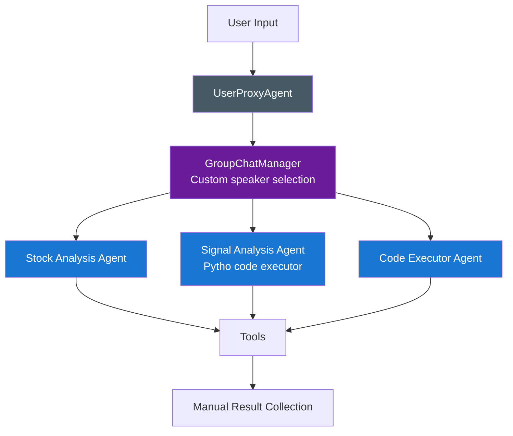
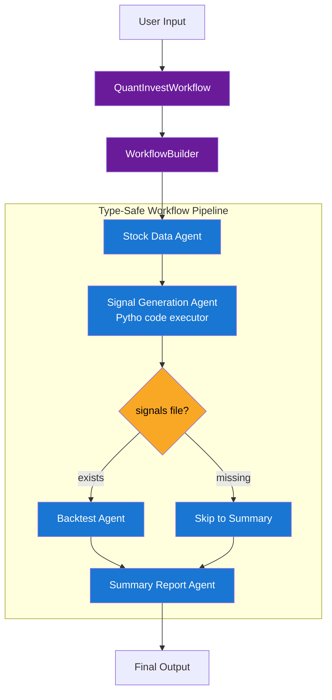
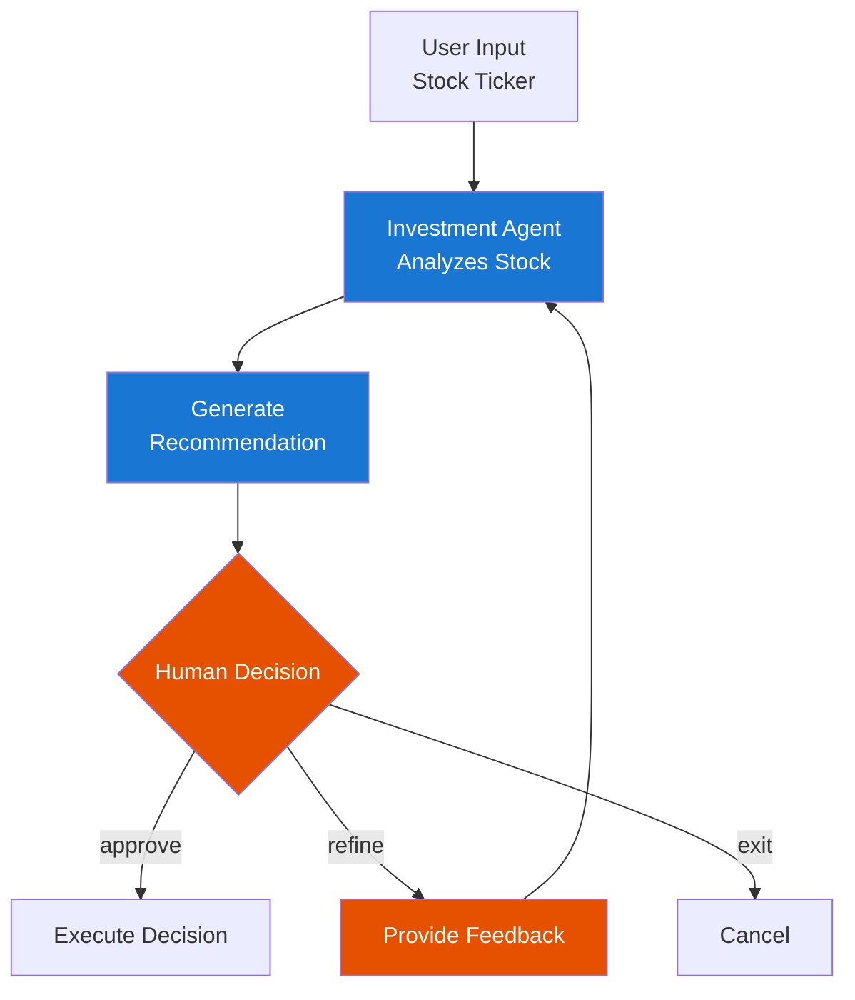

# 💸 Quantitative Investment Agent

**Multi-agent quantitative investment analysis system**  

- Built with [Microsoft Agent Framework](https://github.com/microsoft/agent-framework) (Semantic Kernel + AutoGen), featuring a workflow inspired by [Pregel](https://research.google/pubs/pub37252/).  
- Legacy version built with AutoGen (See the [README.md](./legacy_autogen/README.md) under `legacy_autogen`)
- [Assumptions behind the CAGR calculation](./legacy_autogen/README.md/#cagr-calculation)

## 📖 Overview

An automated trading analysis system that:
- Fetches stock data from Yahoo Finance
- Generates technical trading signals (MACD, RSI, etc.)
- Backtests strategies with performance metrics (CAGR, MDD, Sharpe Ratio)
- Uses workflow-based orchestration for agent coordination

Architecture: Workflow-based with executors, function tools, and type-safe schemas.

## 🚀 Quick Start

```bash
# 1. Install dependencies
uv sync
# Or if using poetry: poetry install

# 2. Set up environment variables
cp .env.example .env
# Edit .env and add your OpenAI-compatible credentials (e.g., https://proxy.openai-next.com/v1)

# 3. Run the workflow
python main.py
```

### Required environment variables

```
OPENAI_API_KEY=your-key
OPENAI_MODEL=gpt-4o
OPENAI_BASE_URL=https://api.openai-next.com/v1
```

默认会请求 (https://api.openai-next.com/v1)，你也可以把 `OPENAI_BASE_URL` 改成任何兼容 OpenAI 的服务地址。

## Samples

See the generated files under `output`.

- Input sample
```
Analyze Apple (AAPL) stock using a momentum trading strategy:
1. Fetch historical data from 2023-01-01 to 2024-01-01
2. Generate buy/sell signals using MACD and RSI indicators
3. Backtest the strategy with initial capital of $10,000
4. Report performance metrics (CAGR, total return, final value)
```

- Output sample
```
===== Final Output =====
Summary report — backtest outcome

Key results
- Final portfolio value: $11,157.97
- Total return: 11.58% (profit $1,157.97 on implied $10,000 start)
- CAGR: 11.68% (close to total return → consistent with ~1-year test horizon)
- Result files: backtest_results.xlsx / backtest_metrics.txt

Quick interpretation
- The strategy produced a positive return (~11.6%) on the test period with a final value of $11.16k.
- The near-equality of CAGR and total return indicates the backtest covers roughly one year (or that returns were concentrated in a short single-period test).
- The absolute profit ($1,157.97) is modest but meaningful for a single-year horizon; risk-adjusted conclusions require volatility and drawdown data (not included here).
```

## 🏗️ Architecture

### Data-Flow Workflow Pattern



**Key Components**:
- **Executors**: Workflow building blocks (agents with tools)
- **Edges**: Data flow connections with conditional routing
- **WorkflowBuilder**: Constructs the data-flow graph
- **Function Tools**: `agent_tools.py`

## 🔑 Key Differences from AutoGen

| Aspect | Legacy AutoGen | Microsoft Agent Framework |
|--------|---------------|--------------------------|
| **Orchestration** | `GroupChat` + `select_speaker` | `WorkflowBuilder` + edges |
| **Message Flow** | Broadcast to all agents | Data flows through edges |
| **Agents** | `AssistantAgent`, `ConversableAgent` | `ChatAgent` (stateless) |
| **Tools** | `FunctionTool` class | class or `@ai_function` decorator |
| **State** | Built into agents | `AgentThread` for context |
| **Pattern** | Control-flow (event-driven) | Data-flow (workflow-based) |
| **Routing** | Custom logic in manager | Conditional edges |

## 📊 System Architecture Comparison

### Legacy AutoGen Architecture



### Microsoft Agent Framework Architecture



**Key Improvements**:
- ✅ **Automatic routing** via conditional edges
- ✅ **Built-in error handling** via WorkflowOutputEvent, ExecutorCompletedEvent
- ✅ **Type safety** with Pydantic models (AgentCompletedResult)
- ✅ **Streaming support** via Workflow.run_stream
- ✅ **State management** via WorkflowContext
- ✅ **Visualization** via WorkflowViz (generates Mermaid diagrams)

## 📁 Project Structure

```
autogen-quant-invest-agent/
├── main.py                  # Entry point
├── agent_workflow.py        # Workflow orchestration
├── agent_quant.py           # Agent definitions
├── agent_tools.py           # Function tools
├── constants.py             # Configuration
├── pyproject.toml           # Dependencies
├── human_in_loop/           # Human oversight samples
│   └── main_invest_approval.py  # Investment approval workflow
├── output/                  # Generated files
│   ├── stock_data.csv
│   ├── stock_signals.csv
│   ├── backtest_results.xlsx
│   └── backtest_metrics.txt
└── legacy_autogen/          # Original AutoGen implementation
```

---

## 🧑‍💼 Human-in-the-Loop: Investment Approval Workflow

The `human_in_loop/main_invest_approval.py` sample demonstrates a **human oversight pattern** for critical investment decisions using `RequestInfoExecutor`.

### Features

- **Human approval gates**: Agent generates investment recommendations, then pauses for human approval
- **Iterative refinement**: Humans can request modifications with specific feedback (e.g., "refine focus on risk factors")
- **Structured output**: Uses Pydantic `response_format` for type-safe investment recommendations (ticker, action, rationale, confidence)
- **Multi-turn workflow**: Continues until human approves, requests changes, or exits

### Workflow Pattern



### Usage

```bash
# Run the human-in-the-loop workflow
python human_in_loop/main_invest_approval.py

# Example interaction:
# Enter ticker: MSFT
# [Agent analyzes and generates recommendation]
# Your decision: refine focus on risk factors
# [Agent refines based on feedback]
# Your decision: approve
```

### Key Components

- **InvestmentTurnManager**: Coordinates agent-human turns and processes approval/feedback
- **RequestInfoExecutor**: Pauses workflow for human input at critical decision points
- **InvestmentRecommendation**: Pydantic model for structured output (BUY/SELL/HOLD with rationale)
- **Multi-turn loop**: Continues until human approval or cancellation

This pattern is essential for **high-stakes AI applications** where human oversight is required before executing decisions.

---

## 📊 Dev UI

The `dev_ui/main_dev_ui.py` sample demonstrates Dev UI Integration with `QuantInvestWorkflow`. 


## 📚 Resources

- Official documentation: [Overview](https://learn.microsoft.com/en-us/agent-framework/user-guide/workflows/overview) | [Tutorials](https://learn.microsoft.com/en-us/agent-framework/tutorials/overview) |  [Migration from-autogen](https://learn.microsoft.com/en-us/agent-framework/migration-guide/)
- Official GitHub repository: [Microsoft Agent Framework](https://github.com/microsoft/agent-framework)
- [Microsoft Agent Framework Sample](https://github.com/microsoft/Agent-Framework-Samples)

## 📝 License

MIT
